# Contextualized Knowledge Graph Embedding for Online Streaming Recommendation Platform

# Abstract
To fulfill the rising demand for personalized movie recommendations, this research employs contextualized knowledge graph embedding for an enhanced streaming platform user experience. Covering UI/UX design, backend, and middleware, the research tailors movie suggestions based on individual preferences. Evaluation via Docker incorporates Knowledge Graph, Content-based filtering, TopN, and TensorFlow models for smarter, personalized recommendations. The application not only provides personalized suggestions but also ensures efficient content management and seamless Docker integration. The knowledge graph enhances collaborative filtering, addressing challenges like semantic sparsity and subjective user preferences. Spanning knowledge representation, machine learning, recommendation systems, web development, and system deployment, the research demonstrates its interdisciplinary nature. Despite promising capabilities, challenges in subjective taste capture persist. Addressing legal, ethical, and social issues involves mitigating over-personalization risks, ensuring transparency, and incorporating diverse recommendations. Ethical considerations stress avoiding differential treatment, promoting explainability, and implementing security measures. The findings encompass functional systems, algorithm evaluation, and insights, offering avenues for improving recommendation quality and user satisfaction.

## Project Beginning

To initiate the project, use the following command:

```bash
make run
```

# Catalog Introduction
1. API
Load model
Provide interface
Utilizes Python Flask framework
2. Crawl
Obtain media data from IMDB through interface
3. Docker
Environment management
4. Knowledge-Graph
Data processing & loading into Neo4j
5. Notebooks
Model training, including Content-based-filtering, TensorFlow Recommenders, LSTM
6. Realtime-Consumption
Uses Golang and Kafka to serve real-time recommendations
7. Web
Project frontend & management backend
Developed using PHP, Apache, HTML, CSS, JavaScript, jQuery, etc.

# Create Topic for the First Time
Execute the following command to create a Kafka topic for web rating data:

```bash
docker exec -it kafka_container_name /opt/kafka/bin/kafka-topics.sh --create --topic web_rating_data --bootstrap-server localhost:9092 --partitions 1 --replication-factor 1
```
# Interface Successfully Tested

## Use the following curl commands to test the interfaces:

### Content-Based Filtering Recommendations:
#### Content-Based Filtering Recommendations:
```bash
curl -X POST -H "Content-Type: application/json" -d '{"movie": "Ice Age: Continental Drift"}' http://127.0.0.1:5001/content_based_CF_recommendations
```
#### TensorFlow Recommenders Predictions:
```bash
curl -X POST -H "Content-Type: application/json" -d '{"user": 1}' http://127.0.0.1:5001/tfrs_predict
```

#### LSTM Predictions:
```bash
curl -X POST -H "Content-Type: application/json" -d '{"text":"this is bad"}' http://localhost:5001/lstm-predict
```

#### Knowledge Graph Recommendations:
```bash
curl http://127.0.0.1:5001/kg_recommendations?userid=2&limit=20
```

### Interdisciplinary Research Focus: Knowledge Representation, Machine Learning, Recommendation Systems, Web Development, and System Deployment
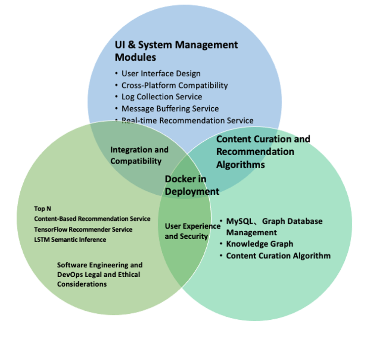

### Data Collection and Preprocessing
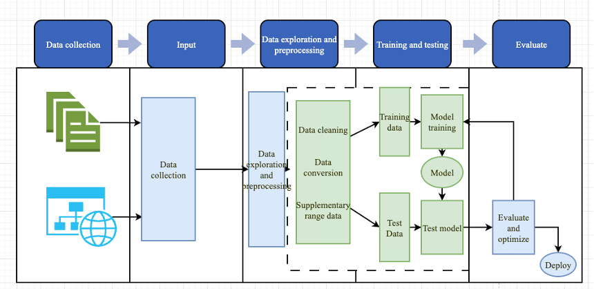

### System project architecture
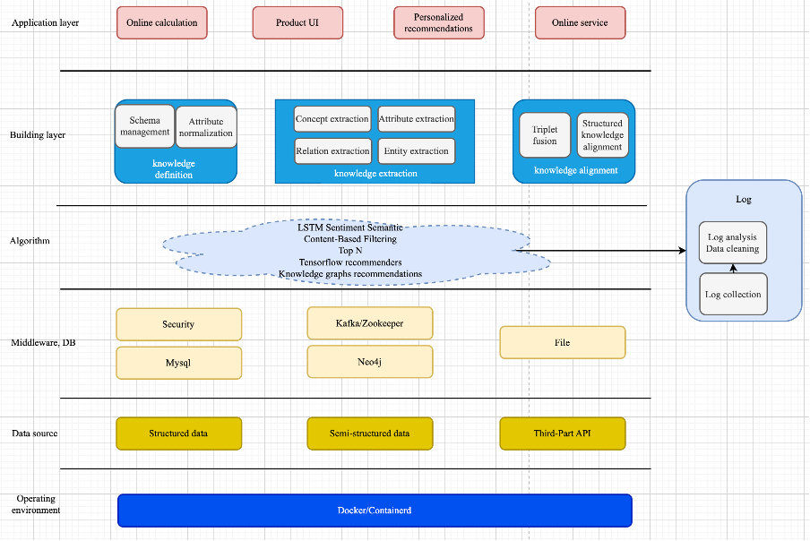

### System Management Architecture Diagram
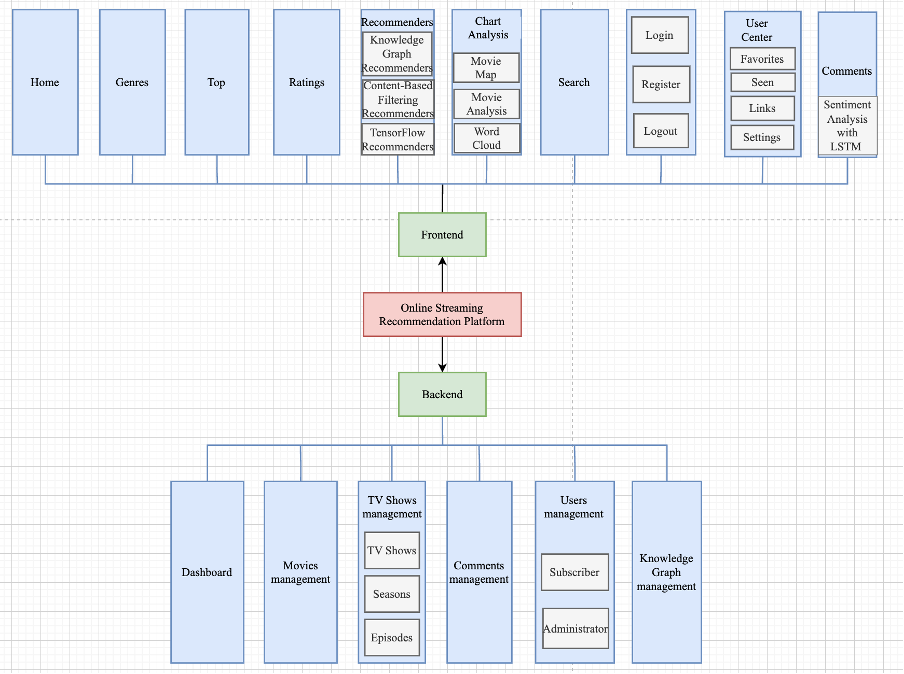

### Recommender Process Diagram
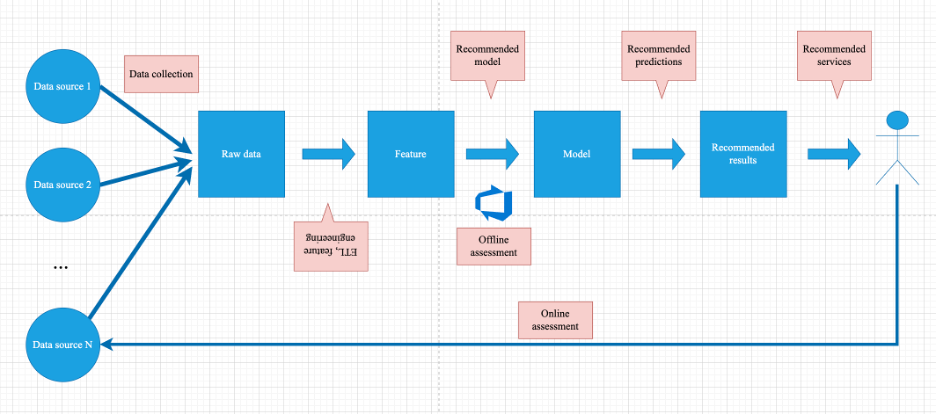

### Knowledge graph relationships between movies, actors, directors, categories, etc.
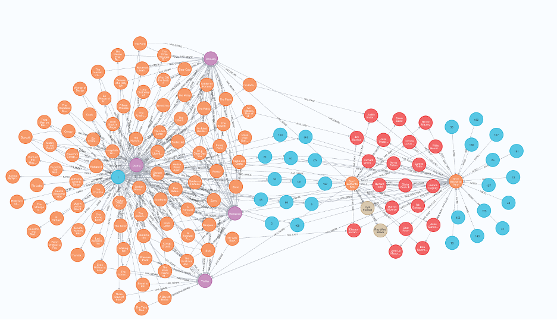

### Accuracy for LSTM sentiment semantic analysis for comments
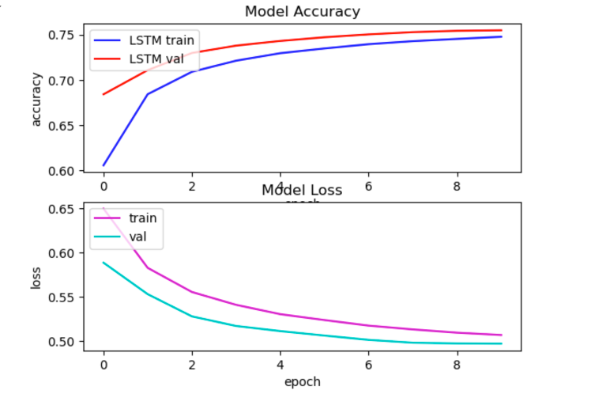

### Confusion Matrix for LSTM sentiment semantic analysis for comments
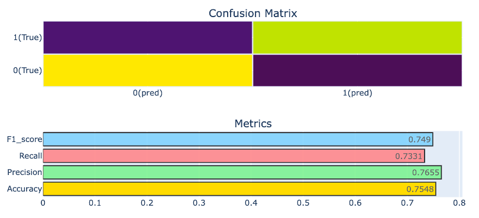

## Interface display

### Home page first screen
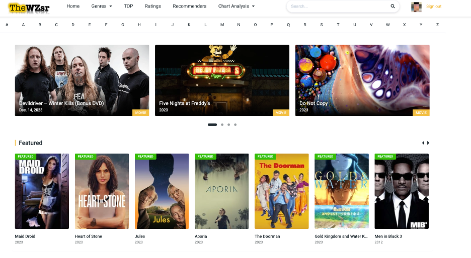

### Comments & LSTM-sentiment
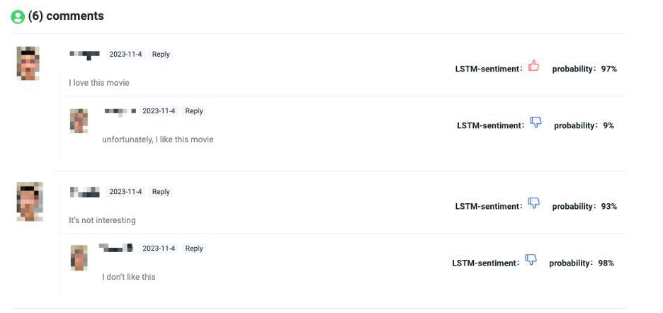

### Knowledge Graph Recommenders
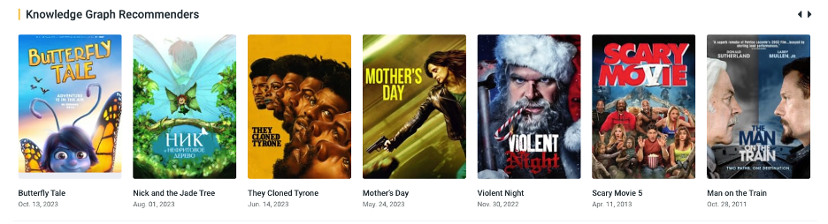

### Content-Based Filtering Recommenders
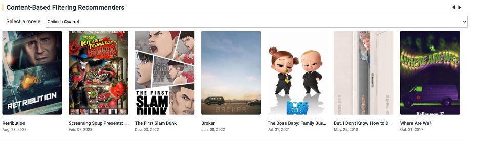

### TensorFlow Recommenders Base On User
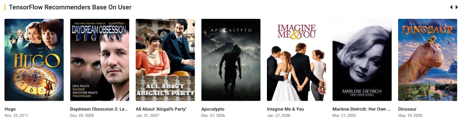

### Rating TopN
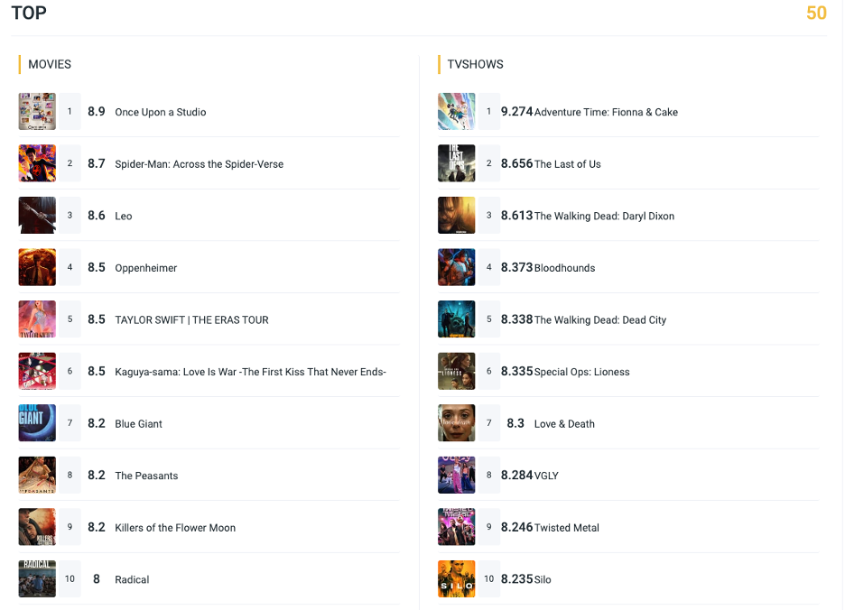

### Movie World Map
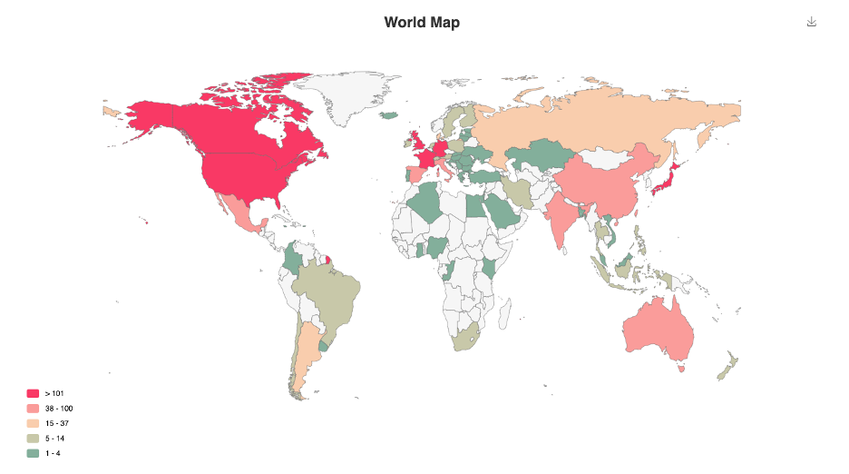

### Word Cloud
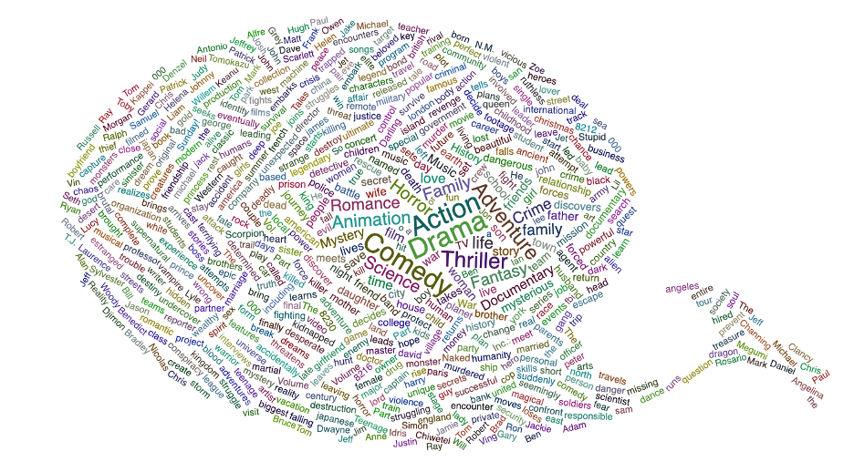